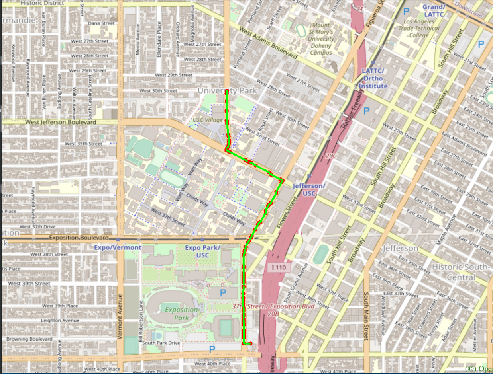
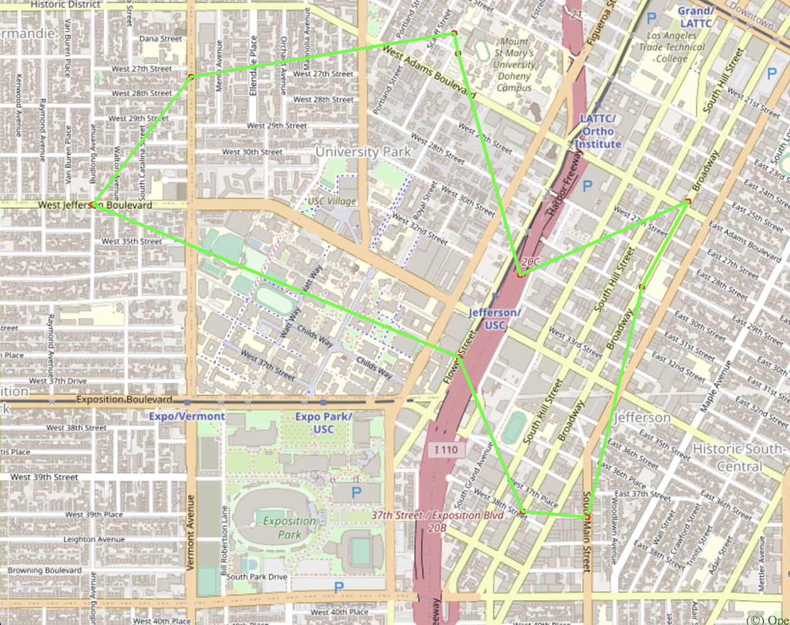
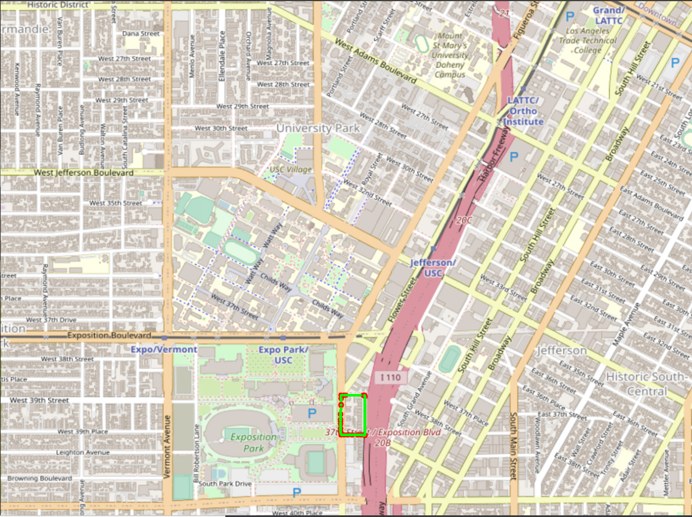
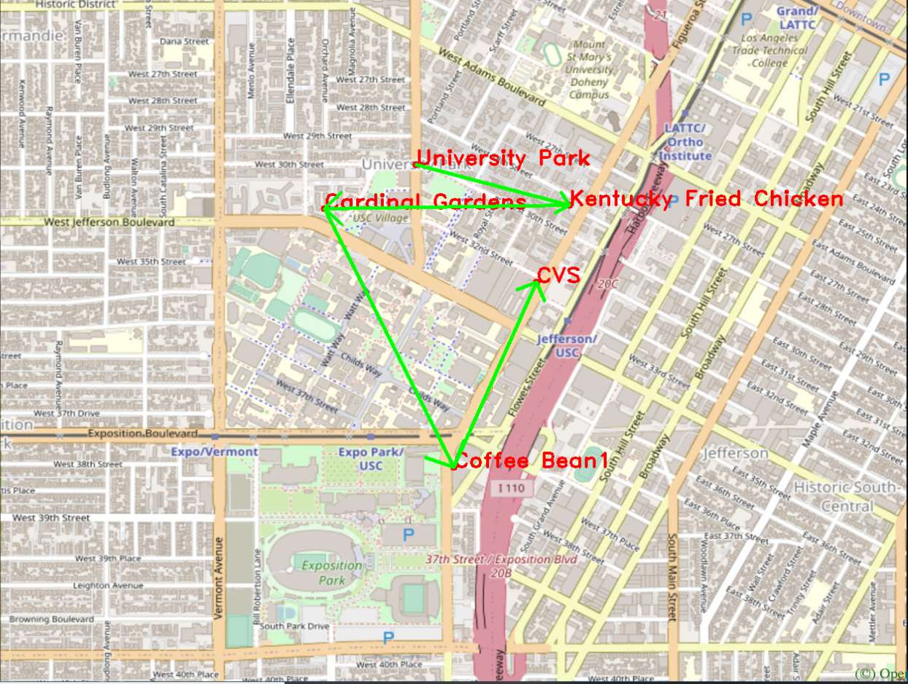

# EE599 Final Project - Spring 2021 - TrojanMap

## Author: Tianhong Qi

## TrojanMap

This project focuses on using data structures in C++ and implementing various graph algorithms to build a map application.

<p align="center"></p>

---

## The data Structure

Each point on the map is represented by the class **Node** shown below and defined in [trojanmap.h](src/lib/trojanmap.h).

```cpp
class Node {
  public:
    std::string id;    // A unique id assign to each point
    double lat;        // Latitude
    double lon;        // Longitude
    std::string name;  // Name of the location. E.g. "Bank of America".
    std::vector<std::string>
        neighbors;  // List of the ids of all neighbor points.
};

   // A map of ids to Nodes.
  std::map<std::string, Node> data;
```

---

## Run the program

Please run:

```shell
$ bazel run src/main:main
```

If everything is correct, this menu will show up.

```shell
Torjan Map
**************************************************************
* Select the function you want to execute.                  
* 1. Autocomplete                                             
* 2. Find the position                                        
* 3. CalculateShortestPath(Dijkstra)                          
* 4. CalculateShortestPath(Bellman_Ford)                      
* 5. Travelling salesman problem(Brute Force)                 
* 6. Travelling salesman problem(2opt)                        
* 7. Cycle Detection                                          
* 8. Topological Sort                                         
* 9. Exit 
**************************************************************
Please select 1 - 9:
```

## Test the program

To use the tests created by professor and TAs to test my program, please run
```shell
$ bazel test tests:trojanmap_test
```

To use the tests created by myself to test my program, please run

```shell
$ bazel test tests:trojanmap_test_student
```

## Details for my implementation:

## Step 1: Autocomplete the location name

```c++
/**
 * Autocomplete: Given a parital name return all the possible locations with
 * partial name as the prefix.
 *
 * @param  {std::string} name          : partial name
 * @return {std::vector<std::string>}  : a vector of full names
 */
std::vector<std::string> Autocomplete(std::string name);
```

 I implement a method to type the partial name of the location and return a list of possible locations with partial name as prefix. I treat uppercase and lower case as the same character.

<p align="center"></p>

Time complexity: **O(n)**, n is the number of location ids in the data.

Examples:

```shell
1
**************************************************************
* 1. Autocomplete                                             
**************************************************************
Please input a partial location:sai
*************************Results******************************
Saint James Park
Saint Agnes Elementary School
Saint Marks Lutheran Church
**************************************************************
Time taken by function: 1694 microseconds

1
**************************************************************
* 1. Autocomplete                                             
**************************************************************
Please input a partial location:sA
*************************Results******************************
Saint James Park
Saint Agnes Elementary School
Saint Marks Lutheran Church
**************************************************************
Time taken by function: 1582 microseconds
```


## Step 2: Find the place's Coordinates in the Map

```c++
/**
 * GetPosition: Given a location name, return the position.
 *
 * @param  {std::string} name          : location name
 * @return {std::pair<double,double>}  : (lat, lon)
 */
std::pair<double, double> GetPosition(std::string name);
```

 There are no duplicated location names. I mark the given locations on the map. If the location does not exist, return (-1, -1).

<p align="center"></p>

Time complexity: **O(n)**, n is the number of location ids in the data.

Example:

```shell
2
**************************************************************
* 2. Find the position                                        
**************************************************************
Please input a location:Target
*************************Results******************************
Latitude: 34.0257 Longitude: -118.284
**************************************************************
Time taken by function: 1215 microseconds
```

<p align="center"></p>

```shell
2
**************************************************************
* 2. Find the position                                        
**************************************************************
Please input a location:ChickfilA
*************************Results******************************
Latitude: 34.0167 Longitude: -118.283
**************************************************************
Time taken by function: 1866 microseconds
```

<p align="center"></p>

## Step 3: CalculateShortestPath between two places

```c++
/**
 * CalculateShortestPath_Dijkstra: Given 2 locations, return the shortest path which is a
 * list of id.
 *
 * @param  {std::string} location1_name     : start
 * @param  {std::string} location2_name     : goal
 * @return {std::vector<std::string>}       : path
 */
std::vector<std::string> CalculateShortestPath_Dijkstra(std::string &location1_name,
                                               std::string &location2_name);
std::vector<std::string> CalculateShortestPath_Bellman_Ford(std::string &location1_name,
                                               std::string &location2_name);
```

The distance between 2 points is the euclidean distance using latitude and longitude. I implement both Dijkstra algorithm and Bellman-Ford algorithm. Compare the time for the different methods. Show the routes on the map. If there is no path, return empty vector.

**Dijkstra**

<p align="center"></p>

Time complexity: **O( n+m*log(m) )**, n is the number of location ids in the data, m is the number of edges.

```shell
3
**************************************************************
* 3. CalculateShortestPath(Dijkstra)                          
**************************************************************
Please input the start location:University Park
Please input the destination:Subway
*************************Results******************************
7360410739
122719216
6813405232
4015372486
7071032399
4015372485
6813379479
5237381975
6813379481
7204030702
4015372484
6813379430
6813379429
544671955
21306061
6813379428
6813416122
544671962
21306060
6813379469
6813379427
123005255
6807200376
6807200380
6813379451
6813379463
123327639
6813379460
4141790922
4015423963
1286136447
1286136422
4015423962
6813379494
63068643
6813379496
123241977
4015372479
4015372477
1732243576
6813379548
4015372476
4015372474
4015372468
4015372463
6819179749
1732243544
6813405275
348121996
348121864
6813405280
1472141024
6813411590
216155217
6813411589
1837212103
1837212101
6820935911
932416162
4060015482
4020099365
6820972450
1732243549
6820972451
122436252
1836105028
4060015481
4020099358
6814990127
7867091027
7867091030
6226313827
932378219
6814990112
1870795293
6814990128
4060015480
1870795287
4020099348
1870795282
1870787389
1870795272
1870795261
1870795259
1855150081
1759017530
The distance of the path is:1.2865 miles
**************************************************************
Time taken by function: 44174 microseconds
```

**Bellman_Ford**

<p align="center"></p>

Time complexity: **O( m * n )**, n is the number of location ids in the data, m is the number of edges.

```shell
4
**************************************************************
* 4. CalculateShortestPath(Bellman_Ford)                      
**************************************************************
Please input the start location:University Park
Please input the destination:Subway
*************************Results******************************
7360410739
122719216
6813405232
4015372486
7071032399
4015372485
6813379479
5237381975
6813379481
7204030702
4015372484
6813379430
6813379429
544671955
21306061
6813379428
6813416122
544671962
21306060
6813379469
6813379427
123005255
6807200376
6807200380
6813379451
6813379463
123327639
6813379460
4141790922
4015423963
1286136447
1286136422
4015423962
6813379494
63068643
6813379496
123241977
4015372479
4015372477
1732243576
6813379548
4015372476
4015372474
4015372468
4015372463
6819179749
1732243544
6813405275
348121996
348121864
6813405280
1472141024
6813411590
216155217
6813411589
1837212103
1837212101
6820935911
932416162
4060015482
4020099365
6820972450
1732243549
6820972451
122436252
1836105028
4060015481
4020099358
6814990127
7867091027
7867091030
6226313827
932378219
6814990112
1870795293
6814990128
4060015480
1870795287
4020099348
1870795282
1870787389
1870795272
1870795261
1870795259
1855150081
1759017530
The distance of the path is:1.2865 miles
**************************************************************
Time taken by function: 54182428 microseconds
```

**My Route:**

<p align="center"></p>

**Google Map's Route**:

<p align="center"></p>

**Conclusion**:  My route is very similar to google map's route, so I successfully implemented these two algorithms. In addition, the optimized version ( based on priority queue ) Dijkstra algorithm has the lower time complexity, which is also more efficient than bellman-ford algorithm. 

## Step 4: The Travelling Trojan Problem (AKA Traveling Salesman!)

In this section, a complete graph is given to me. That means each node is a neighbor of all other nodes.
Given a vector of location ids, assume every location can reach all other locations in the vector (i.e. assume that the vector of location ids is a complete graph).
Find the shortest route that covers all the locations exactly once and goes back to the start point.

I implemented the following two algorithms:

- Brute Force Method
- [2-opt Heuristic](https://en.wikipedia.org/wiki/2-opt). Also see [this paper](http://cs.indstate.edu/~zeeshan/aman.pdf)
```c++
/**
 * Travelling salesman problem: Given a list of locations, return the shortest
 * path which visit all the places and back to the start point.
 *
 * @param  {std::vector<std::string>} input : a list of locations needs to visit
 * @return {std::pair<double, std::vector<std::vector<std::string>>} : a pair of total distance and the all 	the progress to get final path
 */
std::pair<double, std::vector<std::vector<std::string>>> TravellingTrojan(
      std::vector<std::string> &location_ids);
std::pair<double, std::vector<std::vector<std::string>>> TravellingTrojan_2opt(
      std::vector<std::string> &location_ids);
```
**Brute Force Method**:

<p align="center"></p>

Time complexity: **O(n!)**, n is the number of location ids.

```shell
5
**************************************************************
* 5. Travelling salesman problem(Brute Force)                 
**************************************************************
In this task, we will select N random points on the map and you need to find the path to travel these points and back to the start point.

Please input the number of the places:10
Calculating ...
*************************Results******************************
6805295626
4583266241
6813379493
368173251
6818460814
6807241418
4015477530
4399914044
6788057222
6474130386
6805295626
**************************************************************
The distance of the path is:4.29791 miles
**************************************************************
You could find your animation at src/lib/output.avi.          
Time taken by function: 9377598 microseconds
```

<p align="center"></p>

<p align="center"></p>

**2-opt Heuristic**:

<p align="center"></p>

Time complexity: **O(n^2)**, n is the number of location ids.

```shell
6
**************************************************************
* 6. Travelling salesman problem(2opt)                        
**************************************************************

In this task, we will select N random points on the map and you need to find the path to travel these points and back to the start point.

Please input the number of the places:30
Calculating ...
*************************Results******************************
5768963649
6790463796
1790748077
33078883
4012792179
4399914037
123292049
6820982886
269635544
269633281
4015372463
354062976
269635105
5768963637
5768963620
6817197864
6807241418
4835549595
1732340067
2613117900
2613117900
6816822864
7882624618
6047202831
1849116069
6816831441
5541796228
6805827713
933924387
1855145672
5768963649
**************************************************************
The distance of the path is:6.88329 miles
**************************************************************
You could find your animation at src/lib/output.avi.          
Time taken by function: 471072 microseconds
```

<p align="center"></p>

<p align="center"></p>

**Conclusion**:  According to the above examples, we can see that my 2opt algorithm has a good performance. In most cases, my 2opt algorithm can calculate the optimal solution. I use 30 points as an example to test my 2opt method, while only 10 points to test my brute-force method, the time complexity of 2opt is much less than brute-force. With the number of input increasing, the brute-force method performs increasingly terrible. 

## Step 5: Cycle Detection

```c++
/**
 * Cycle Detection: Given four points of the square-shape subgraph, return true if there
 * is a cycle path inside the square, false otherwise.
 * 
 * @param {std::vector<double>} square: four vertexes of the square area
 * @return {bool}: whether there is a cycle or not
 */
bool CycleDetection(std::vector<double> &square);
```

I use a square-shaped subgraph of the original graph by using four coordinates stored in ```std::vector<double> square```, which follows the order of left, right, upper, and lower bounds. Then I determine if there is a cycle path in the that subgraph. If it does, return true and report that path on the map. Otherwise return false.

<p align="center"></p>

Time complexity: **O(m+n)**, n is the number of location ids in the data, m is the number of edges.

Example1: If there is **a cycle** in the map, the function will **plot the first cycle** it meets.

```shell
7
**************************************************************
* 7. Cycle Detection                                          
**************************************************************
Please input the left bound longitude(between -118.299 and -118.264):-118.299
Please input the right bound longitude(between -118.299 and -118.264):-118.264
Please input the upper bound latitude(between 34.011 and 34.032):34.032
Please input the lower bound latitude(between 34.011 and 34.032):34.011
*************************Results******************************
there exists cycle in the subgraph 
**************************************************************
Time taken by function: 69146 microseconds
```

<p align="center"></p>

Example 2: If there is **no cycle** in the map, the function will **plot the subgraph**.

I use the function below to visualize the subgraph.

```c++
/**
 * PlotPoints: Given a vector of location ids draws the points on the map (no path).
 * 
 * @param  {std::vector<std::string>} location_ids : points inside square
 * @param  {std::vector<double>} square : boundary
 */
void TrojanMap::PlotPointsandEdges(std::vector<std::string> &location_ids, std::vector<double> &square)
```
Here I use a square area inside USC campus as our subgraph
```shell
7
**************************************************************
* 7. Cycle Detection                                          
**************************************************************
Please input the left bound longitude(between -118.299 and -118.264):-118.290919
Please input the right bound longitude(between -118.299 and -118.264):-118.282911
Please input the upper bound latitude(between 34.011 and 34.032):34.02235
Please input the lower bound latitude(between 34.011 and 34.032):34.019675
*************************Results******************************
there exist no cycle in the subgraph 
**************************************************************
Time taken by function: 70494 microseconds
```
<p align="center"></p>

## Step 6: Topological Sort

```c++
/**
 * DeliveringTrojan: Given a vector of location names, it should return a sorting of nodes
 * that satisfies the given dependencies.
 *
 * @param  {std::vector<std::string>} locations                     : locations
 * @param  {std::vector<std::vector<std::string>>} dependencies     : prerequisites
 * @return {std::vector<std::string>} results                       : results
 */
std::vector<std::string> DeliveringTrojan(std::vector<std::string> &location_names,
                                            std::vector<std::vector<std::string>> &dependencies);
```

Tommy Trojan got a part-time job from TrojanEats, for which he needs to pick up and deliver food from local restaurants to various location near the campus. Tommy needs to visit a few different location near the campus with certain order, since there are some constraints. For example, he must first get the food from the restaurant before arriving at the delivery point. 

The TrojanEats app will have some instructions about these constraints. So, Tommy asks you to help him figure out the feasible route!


For example, 

```shell
Input: 
location_names = {"Cardinal Gardens", "Coffee Bean1", "CVS"}
dependencies = {{"Cardinal Gardens","Coffee Bean1"}, {"Cardinal Gardens","CVS"}, {"Coffee Bean1","CVS"}}
```

Here, ```{"Cardinal Gardens","Coffee Bean1"}``` means that Tommy must go to `Cardinal Gardens` prior to `Coffee Bean1`.

Your output should be:
```shell
Output: Cardinal Gardens -> Coffee Bean1 -> CVS
```
Also, we provide ```PlotPointsOrder``` function that can visualize the results on the map. It will plot each location name and also some arrowed lines to demonstrate a feasible route.

<p align="center"></p>

Time complexity: **O(m+n)**, n is the number of location ids in the data, m is the number of edges.

```shell
8
**************************************************************
* 8. Topological Sort                                         
**************************************************************
Please input the locations filename:/home/student/Desktop/final-project-YTqth0921/input/topologicalsort_locations.csv
Please input the dependencies filename:/home/student/Desktop/final-project-YTqth0921/input/topologicalsort_dependencies.csv
*************************Results******************************
Topological Sorting Reults:
University Park
Kentucky Fried Chicken
Cardinal Gardens
Coffee Bean1
CVS
**************************************************************
Time taken by function: 753005 microseconds

```
<p align="center"></p>

**Discussion**: If **no feasible route exists** or **there is a cycle in the path**, I simply return an empty vector. I have written these two case in my [trojanmap_test_student.cc](src/tests/trojanmap_test_student.cc). 

### Conclusion & Lessons learned:

1. As a javascript developer, learning C++ in this course strengthen my understanding of memory.
2. Pay attention to write test cases, keep a good habit of handwriting corner cases.
3. This project is a comprehensive practice of what we have learnt in this course. I have learned the theory of Dijkstra in EE450 computer networking, I finally get the opportunity to write this algorithm by myself. The other steps also deepens my understanding of graph algorithms. 
4. After taking this course, I comprehensively understand common algorithms (sort, search, recursion, dynamic programming, backtracking) and data structures (map, set, heap, tree, hash, lists, graphs).


